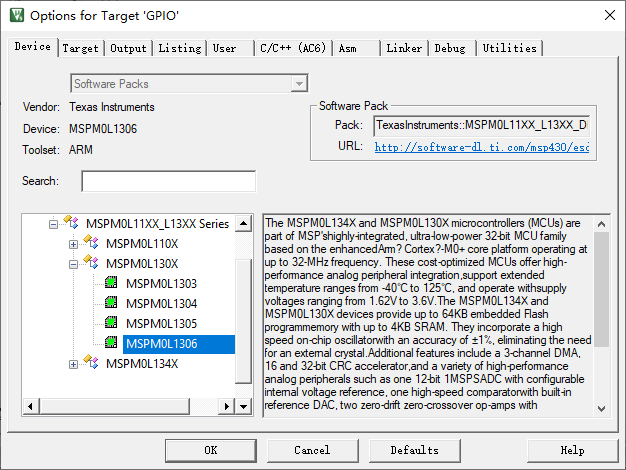
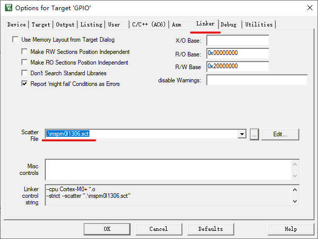
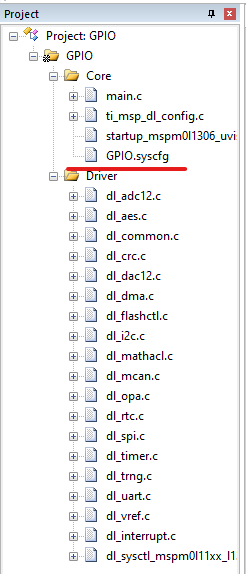
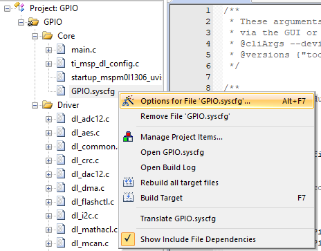
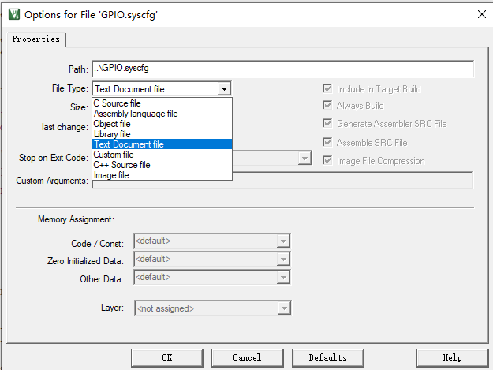
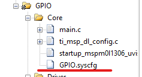
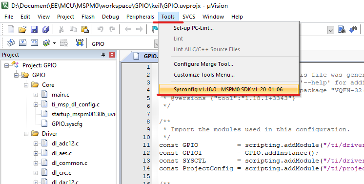
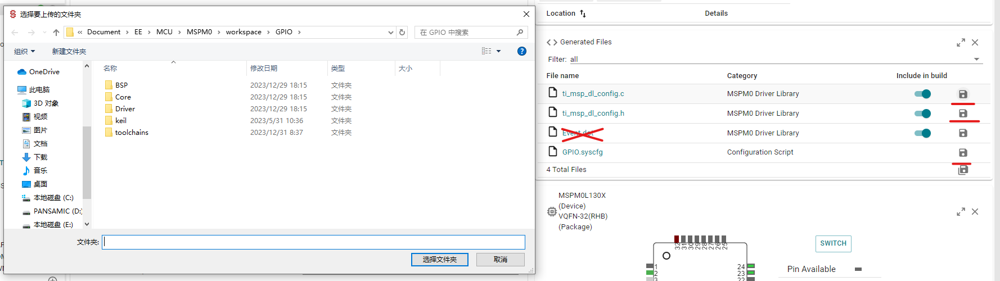

# 从零创建新工程

## 1. 准备所需的文件

新建一个文件夹，例如：`C:\MSPM0_workspace\my_project`。

在该目录下创建子文件夹，最终文件夹结构如下所示：

```
├── BSP   // Board Specific Peripheral板级外设驱动
│   ├── inc // 头文件
│   └── src // 源文件
├── Core  // 单片机核心文件
│   ├── inc // 头文件
│   └── src // 源文件
├── Driver // 单片机驱动文件
│   ├── CMSIS // Cortex-M系列CPU驱动库
│   └── ti
└── keil // Keil MDK文件
```

### 1.1 MSPM0硬件驱动库

复制`<SDK_PATH>/source/ti/driverlib`文件夹到`C:\MSPM0_workspace\my_project\Driver\ti`。删除`C:\MSPM0_workspace\my_project\Driver\ti\driverlib\lib`这个文件夹。

### 1.2 MSPM0设备标识文件

复制`<SDK_PATH>/source/ti/devices`文件夹到`C:\MSPM0_workspace\my_project\Driver\ti`。删除以下文件夹:
1. `C:\MSPM0_workspace\my_project\Driver\ti\devices\msp\m0p\linker_files`
2. `C:\MSPM0_workspace\my_project\Driver\ti\devices\msp\m0p\startup_system_files`

### 1.3 CMSIS

复制`<SDK_PATH>/source/third_party/CMSIS/Core/`到`C:\MSPM0_workspace\my_project\Driver\CMSIS\`

### 1.4 Startup及链接文件

复制`<SDK_PATH>/source/ti/devices/msp/m0p/linker_files/keil/mspm0l1306.sct`到`C:\MSPM0_workspace\my_project\keil\`目录下。

复制`<SDK_PATH>/source/ti/devices/msp/m0p/startup_system_files/keil/startup_mspm0l1306_uvision.s`到`C:\MSPM0_workspace\my_project\keil\`目录下。

## 2. 新建工程

打开Keil，点开最上方的工具栏的`Project`创建新的Keil工程。

## 3. 配置工程

1. 选择芯片，MSPM0L1306

    
2. 选择链接文件

    
3. 按照下图添加C源文件。

    
4. 注意上图中的`XXXX.syscfg`文件，这个文件直接加进来的时候会被标记为汇编语言文件，会被加入编译，但是实际上这个文件不是代码文件，所以需要右键点击这个文件，点击`Option for file`

    
    修改该文件的类型，从汇编语言源代码换成文本文档。这样这个文件就不会被加入编译了。

    
    修改完之后这个文件的图标会变成纯白色图标

    

## 4. 配置外设驱动

在Keil中双击打开`XXXX.syscfg`文件，然后找到Keil最上方工具栏，点击Tools->SysConfig......这个选项。

</br>


然后会打开SysConfig配置界面。按照各个外设的属性配置相应的功能。

## 5. 生成驱动代码
点击SysConfig界面最右边的保存按钮可以保存当前配置代码源文件。

**假设你当前的工程文件目录在C:\workspace\my_proj**

1. `ti_msp_dl_config.c`这个文件需要放在`C:\workspace\my_proj\Core\src`目录下。
2. `ti_msp_dl_config.h`这个文件需要放在`C:\workspace\my_proj\Core\inc`目录下。
3. `XXXX.syscfg`文件需要保存在`C:\workspace\my_proj\`目录下。
4. `Event.dot`不需要保存。




## 6. 在Keil中编译

返回Keil中，点击编译按钮编译。如果出现报错，请查阅[报错及解决方案](/Issue)。

