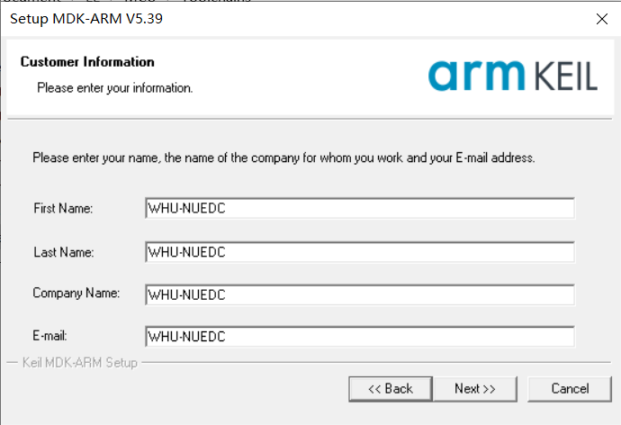

# 配置Keil开发环境

**双击“MDK535.EXE”运行安装软件，勾选我接受许可证协议条款，点击next**

**直接Next'将Keil MDK 5安装到默认的这些文件夹。 按“浏览”选择不同的文件夹进行安装**

</img>

**继续点击next，提示需要输入用户名和邮箱等信息的话，输入任意信息即可，最后安装完成，点击finish退出向导**

**然后以管理员身份运行开始菜单的Keil uVision5，点file-license management**

</img>
</img>

**打开如下界面，这时候我们运keil mdk5破解工具，也就是行crack文件夹中的keygen注册机，将右上角的CID复制到注册机中，然后我们在mdk5破解注册机中选择ARM，并点击注册机中的generate生成按钮，将生成的注册码复制到软件中并点击add lic按钮**

</img>

**接着点击“AddLIC”出现提示成功即可点击close关闭**

</img>

**最后到这里就可以成功获得keil mdk5破解版软件啦**

</img>

**这时可以开始安装MSPM0L器件包,点击下图中的图标**

</img>

**出现芯片包安装界面，在下图所示的输入框中输入MSPM0L，在界面的右半部分找到MSPM0L系列，点击install来安装**

**至此完成了环境部署**