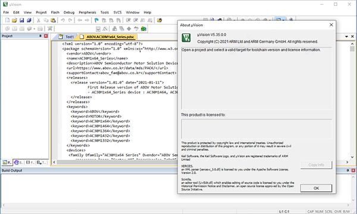

# 配置Keil开发环境

双击“MDK539.EXE”运行安装软件，勾选我接受许可证协议条款，点击next。注意必须安装538及以后的版本。


直接Next'将Keil MDK 5安装到默认的这些文件夹。 按“浏览”选择不同的文件夹进行安装


继续点击next，提示需要输入用户名和邮箱等信息的话，输入任意信息即可，最后安装完成，点击finish退出向导


然后以管理员身份运行开始菜单的Keil uVision5，点file-license management


打开如下界面，这时候我们运行keil mdk5破解工具，也就是keygen注册机，将右上角的CID复制到注册机中，然后我们在mdk5破解注册机中选择ARM，并点击注册机中的generate生成按钮，将生成的注册码复制到软件中并点击add lic按钮


接着点击“AddLIC”出现提示成功即可点击close关闭


最后到这里就可以成功获得keil mdk5破解版软件啦



这时可以开始安装MSPM0L器件包,点击下图中的图标


出现芯片包安装界面，在下图所示的输入框中输入MSPM0L，在界面的右半部分找到MSPM0L系列，点击install来安装


找到SDK安装目录，打开`<SDK_PATH>/tools/keil/MSPM0_SDK_syscfg_menu_import.cfg`，修改第二行的Command参数，把SDK和Sysconfig的安装目录替换成你自己实际的安装目录。

修改前：

```
[Sysconfig v1.18.0 - MSPM0 SDK v1_20_01_06]
Command=C:\ti\sysconfig_1.18.1\nw\nw.exe C:\ti\sysconfig_1.18.1
Initial Folder=c:\ti\mspm0_sdk_1_20_01_06
Arguments=--compiler keil -s ".metadata\product.json" "#E"
Prompt for Arguments=0
Run Minimized=0
Run Independent=-1
```

修改后：

```
[Sysconfig v1.18.0 - MSPM0 SDK v1_20_01_06]
Command=C:\Develop\Embedded\MSPM0\sysconfig_1.18.1\nw\nw.exe C:\Develop\Embedded\MSPM0\sysconfig_1.18.1
Initial Folder=c:\Develop\Embedded\MSPM0\mspm0_sdk_1_20_01_06
Arguments=--compiler keil -s ".metadata\product.json" "#E"
Prompt for Arguments=0
Run Minimized=0
Run Independent=-1
```

注意版本号可能也跟你的实际版本不一样，记得也要改。

点击Keil顶部工具栏中 Tool->Customize Tools Menu，如下图所示：


在弹出的界面中点击`Import`，选取你刚刚改的文件。


至此完成了环境部署