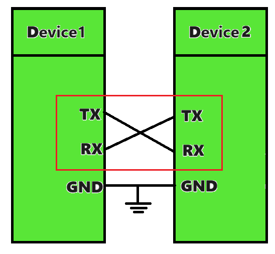
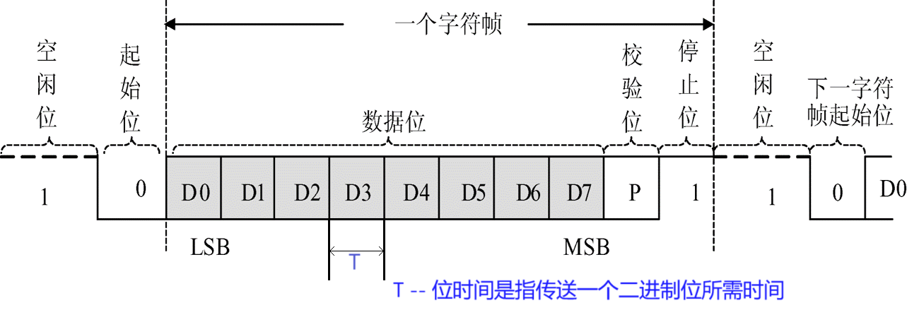

# UART示例代码

## 简介

串行接口简称串口，也称串行通信接口或串行通讯接口（通常指COM接口），是采用串行通信方式的扩展接口。串行接口 （Serial Interface）是指数据一位一位地顺序传送。其特点是通信线路简单，只要一对传输线就可以实现双向通信，但传送速度较慢。
数据以字符为单位，通常使用的是组成字符帧传送的。

字符帧以单帧的方式发送和接收的，帧数据是低位在前、高位在后； 发送方和接收方可以由各自独立的时钟来控制数据的发送和接收，这**两个时钟彼此独立，互不同步，故称异步**。

## Uart

通用异步收发传输器（Universal Asynchronous Receiver/Transmitter，通常称为UART）是一种异步收发传输器。单片机、SOC、PC里都会有UART模块，也就是大家在**嵌入式开发中常常听到的串口（UART）**。

RS232、EIA-485(RS485)这两种总线协议不是像UART和IIC那样是一个单独的协议，这两种协议只是一个物理层和电器层的协议，他们是依赖于串口的，编程的时候（收发器）还是UART，只是说在电气层面进行了一些处理，可以让他的抗干扰能力更强，传输距离更远，提升传输的速度。

**Uart接线方式**

 
## 数据格式

字符帧：也叫数据帧，其组成为：起始位(占1位)、数据位(占5～8位)、奇偶校验位(占1位，也可无校验位)、停止位(占1或2位)。

空闲位：传输线处于**逻辑1（高电平）**状态，表示当前线路上没有数据传送
起始位：发送方发出一个**逻辑0（低电平）**的信号，线路上的信号由高变低电平，表示传输字符的开始。
数据位：紧接着起始位之后。其个数可以是4、5、6、7、8等，构成一个字符。从数据的最低位开始传送，按照波特率发生器的时钟定位。
停止位：一个数据传输的结束标志。 可设定为：无停止位、1位、1.5位、2位的**逻辑1（高电平）**。
波特率(baud rate)：是衡量数据传送速率的指针；表示每秒钟传输 离散信号事件的个数，或每秒钟信号电平信号变化的次数，单位为 band(波特)。

Nb=1/Ts
式中：Nb  —— 波特率；Ts —— 脉冲信号宽度。

例如：数据传送速率为120字符/秒，而每一个字符为10位，则传送的波特率为 10×120＝1200位/秒＝1200波特。
波特率用于表征数据传输的速度，波特率越高，数据传输速度越快。但波特率和字符的实际传输速率不同，字符的实际传输速率是每秒内所传字符帧的帧数，和字符帧格式有关。
**在异步串行通信中，接收方和发送方应使用相同的波特率，才能成功传送数据**。

## 电平标准

TTL、CMOS、RS232、EIA-485(RS485)

### TTL电平标准：

对于输出电路：电压大于等于（≥）2.4V为逻辑1；电压小于等于（≤）0.4V为逻辑0；
对于输入电路：电压大于等于（≥）2.0V为逻辑1；电压小于等于（≤）0.8V为逻辑0；

### CMOS电平标准：

对于输出电路：电压大于等于（≥）0.9*VCC为逻辑1；电压小于等于（≤）0.1*Vcc为逻辑0；
对于输入电路：电压大于等于（≥）0.7*VCC为逻辑1；电压小于等于（≤）0.3*Vcc为逻辑0；
CMOS电平能够驱动TTL电平；TTL电平不能驱动CMOS电平，需要加上拉电阻。

### RS-232

RS-232：标准串口，最常用的一种串行通讯接口。是美国EIA(电子工业联合会)与BELL等公司开发的，于1969年公布的通信协议。适合于数据传输速率在0～20000bit/s内的通信。该标准对串行 通信接口的相关内容，如信号线功能、电器特性都作了明确规定。
电气特性:
TxD和RxD上：
逻辑1(MARK)	= -3V ～ -15V 
逻辑0(SPACE) = +3V ～ ＋15V
RTS、CTS、DSR、DTR和DCD等控制线上：
信号有效（接通，ON状态，正电压）	= +3V ～ +15V
信号无效（断开，OFF状态，负电压） 	= -3V ～ -15V

### EIA-485 (RS-485)

RS485采用差分信号进行通信，总线由2条线组成，分别命名为A和B，当A端电平大于B端电平为+2V ~ +6V时代表1，-2V ~ -6V平时代表0。所以RS485也不能直接与单片机引脚直接连接，而是需要专用的RS485转接芯片才可以与单片机UART接口连接。

内容参考代永红老师嵌入式课程ppt总结。

## 实验步骤

