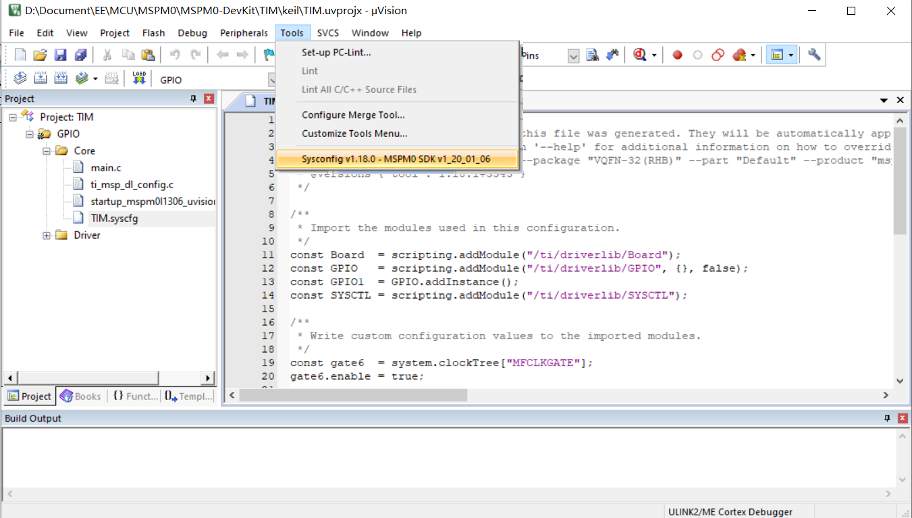
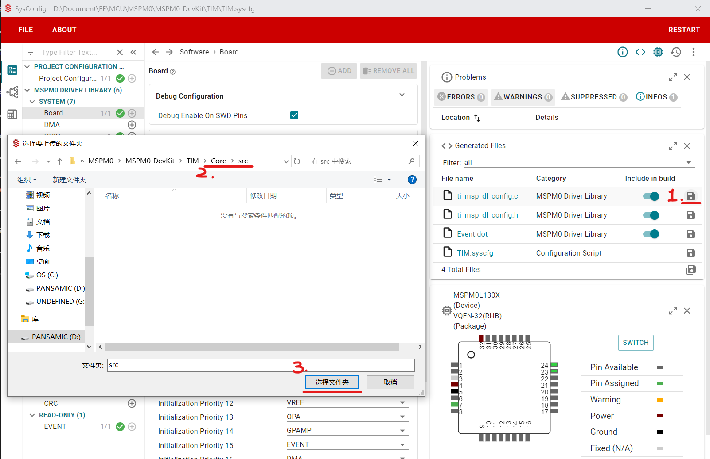
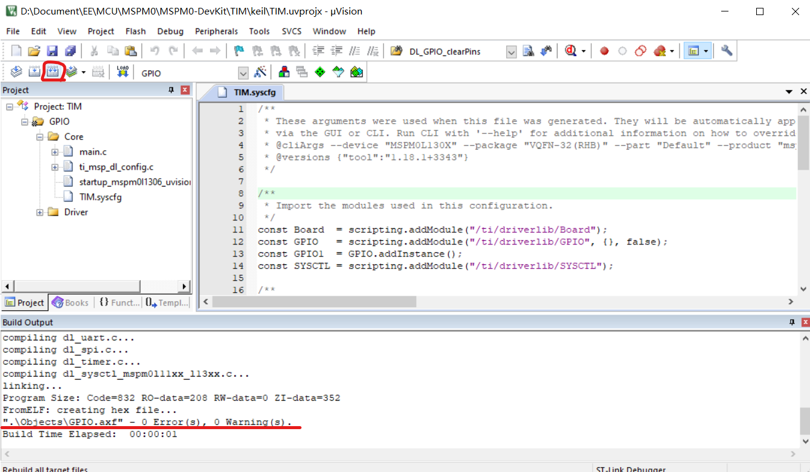
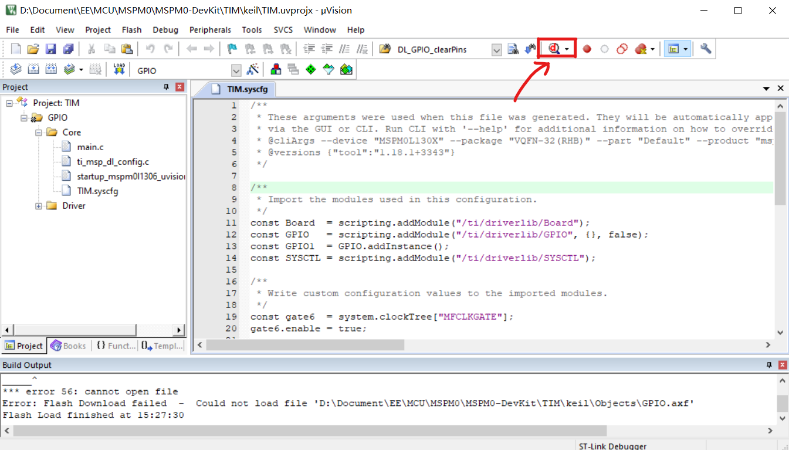

# Keil开发工作流

## 1. 新建工程

随便复制本代码仓库的一个文件夹，如GPIO。以下以新建定时器（Timer）示例代码为例。

* 把文件夹名称`GPIO`改成新名字`TIM`(定时器)。
* 把`TIM`文件夹下的`GPIO.syscfg`名字改成新名字。
* 把`TIM/keil/`文件夹下的`GPIO.uvprojx`改成`TIM.uvprojx`

## 2. 配置工程

双击改名后的Keil工程文件`TIM/keil/TIM.uvprojx`，打开Keil界面。

按照下图，选中`GPIO`，按下`F2`键，可以编辑名称，改为`TIM`

发现在左边面板的Core文件夹下`GPIO.syscfg`文件报错，这是因为之前我们把`GPIO.syscfg`文件改名了，导致Keil无法找到原来的`GPIO.syscfg`文件。

右键点击该文件，点击`Options for File GPIO.syscfg...`

打开下面的界面。修改图中红色画线的地方，把`GPIO`改为`TIM`。

改完之后文件报错消失。

双击打开syscfg文件

按照[配置Keil开发环境](/Development_Env/Keil)配置好环境之后，点击Keil上方工具栏，`Tools->Sysconfig v1.18.0 - MSPM0 SDK v1_20_01_06`

可以打开Sysconfig软件，这个软件用于配置芯片外设。

配置完之后，点击软件右边栏中`ti_msp_dl_config.c`这个文件一行最右边的保存按钮，会打开一个文件夹选择页面，注意保存`ti_msp_dl_config.c`文件到`<Project>/Core/src/`文件夹中。

同样地，点击`ti_msp_dl_config.h`右边的保存按钮，保存到`<Project>/Core/inc/`文件夹下。

## 3. 编译、下载与调试

点击下图中的按钮进行编译。编译通过后，Keil最下方的小窗口应该显示如图所示的信息。

编译完成后，点击下图中的按钮进行调试。

