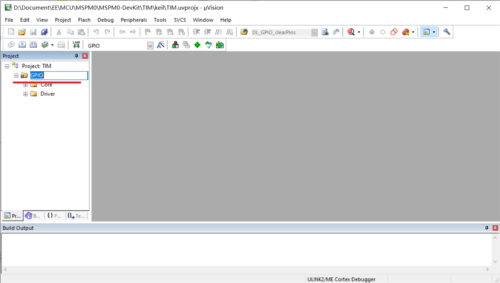

# Keil开发工作流

## 1. 新建工程

随便复制本代码仓库的一个文件夹，如GPIO。以下以新建定时器（Timer）示例代码为例。

* 把文件夹名称`GPIO`改成新名字`TIM`(定时器)。
* 把`TIM`文件夹下的`GPIO.syscfg`名字改成新名字。
* 把`TIM/keil/`文件夹下的`GPIO.uvprojx`改成`TIM.uvprojx`

## 2. 配置工程

双击改名后的Keil工程文件`TIM/keil/TIM.uvprojx`，打开Keil界面。

按照下图，选中`GPIO`，按下`F2`键，可以编辑名称，改为`TIM`

按照[配置Keil开发环境](/Development_Env/Keil)配置好环境之后，

## 3. 调试

