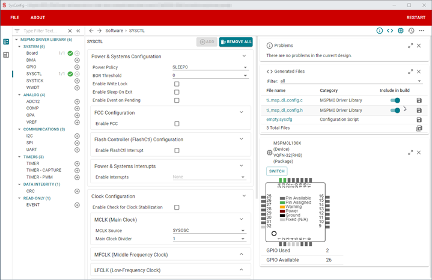

# 芯片配置器

本指南从TI官网指南移植而来，详情可以查看[Ti官网SysConfig](https://software-dl.ti.com/msp430/esd/MSPM0-SDK/1_00_00_04/docs/english/tools/sysconfig_guide/doc_guide/doc_guide-srcs/sysconfig_guide.html)。

## 1. 介绍

本指南描述了如何安装和开始使用SysConfig和MSPM0。

注意:本指南描述了对MSPM0生产设备的支持，不支持早期的实验芯片。有关更多信息，请参阅早期示例迁移指南。

## 2. 下载并安装MSPM0 SysConfig

在使用独立的SysConfig安装程序时需要这些说明，这是当前IAR、Keil或其他ide所必需的。CCS以外的ide可以在它们的应用程序中使用这个版本的SysConfig，或者只使用它生成的文件。在开始使用MSPM0 SysConfig一节中还有其他步骤，可以将此版本集成到CCS中。

1. 从[TI.com](https://www.ti.com/tool/download/SYSCONFIG/)下载SysConfig

2. 安装SysConfig

SysConfig的界面应该如下所示：

## 3. 开始使用MSPM0 SysConfig

本节介绍如何在各种ide中集成和使用SysConfig的独立版本，以及如何打开Project。

### 3.1 在Keil中启用SysConfig

1. 导航到您的SDK文件夹`<MSPM0_SDK_INSTALL_DIR>/tools/keil/`并打开`syscfg.bat`进行编辑(不执行)。
2. 修改下面红色显示的`SYSCFG_PATH`，以匹配在[下载和安装MSPM0 SysConfig](#2-下载并安装mspm0-sysconfig)小节中选择的独立SysConfig路径。

3. 在同一文件夹中，打开<MSPM0_SDK_INSTALL_DIR/tools/keil/MSPM0_SDK_syscfg_menu_import.cfg进行编辑。

4. 修改SysConfig和SDK的版本和路径。

* SysConfig版本和路径以红色突出显示，它应该与[下载和安装MSPM0 SysConfig小节](#2-下载并安装mspm0-sysconfig)中选择的内容相匹配。

* SDK版本和路径以蓝色突出显示，对应于`MSPM0_SDK_INSTALL_DIR`。

5. 在Keil uVision中，选择**Tools**→**Custom Tool Menu**from the menu.

6. 点击**import**

7. 切换到SDK文件夹`<MSPM0_SDK_INSTALL_DIR>/tools/keil/`并打开**MSPM0_SDK_syscfg_menu_import.cfg**。

8. 点击OK关闭窗口

9. 工具现在将出现在菜单上。它将用于打开GUI，这将在下一节中解释。

### 3.2 在Keil中导入SysConfig工程

按照以下步骤在Keil中导入和使用SysConfig项目。

1. 打开本仓库代码提供的Keil工程。

2. 双击工程目录中的*.syscfg文件。

3. 在编辑器中打开*.syscfg文件之后，单击**Tools**并选择在先前[在Keil中启用SysConfig](#31-在keil中启用sysconfig)小节中配置的工具。

4. 这将打开SysConfig并允许您配置外设、IO引脚和其他设置。注意，这种方法一次只允许打开一个SysConfig GUI。

5. 保存并切换到Keil软件
6. 重新编译代码